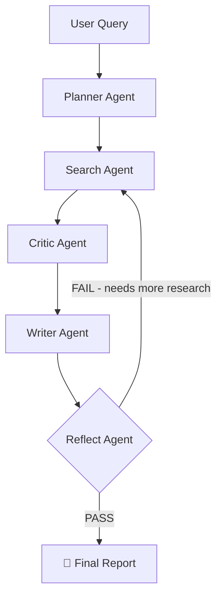

# 🔍 Research Buddy
Multi-agent AI research assistant powered by LangGraph + Groq + Tavily.

[](https://huggingface.co/spaces/ridzzzzzzzzzzzzzz/Research-Buddy)

## Overview
Research Buddy is a multi-agent application that takes a user query and autonomously researches, validates, and writes a comprehensive report using a team of AI agents.

## Architecture

##  Agent Breakdown

**Planner Agent**
Takes the user's raw query and breaks it down into 3 focused sub-questions that together will fully answer the topic.

**Search Agent**
Runs each sub-question through Tavily's real-time web search API and collects the top results. On a reflect retry, it uses new queries generated by the Reflect agent instead.

**Critic Agent**
Reviews all search results, filters out low-quality or irrelevant sources, and flags contradictions between sources before passing clean data to the writer.

**Writer Agent**
Synthesizes the validated research into a structured markdown report with an executive summary, sections for each major finding, and a cited sources list.

**Reflect Agent**
The most unique part of the pipeline — grades the final report on comprehensiveness and source quality. If it fails, it generates new search queries and loops the pipeline back through the Search agent for another iteration (max 2 retries).


##  Features

-  **Self-reflection loop** — agents grade and retry their own output
-  **Live agent streaming** — watch each agent work in real time
-  **Real-time web search** — always up to date via Tavily
-  **Structured reports** — markdown output with citations
-  **Deployed on HF Spaces** — live and accessible with no setup

## Tech Stack
- **LangGraph** — agent orchestration & state machine
- **Groq (Llama 3.3 70b)** — LLM backbone
- **Tavily** — real-time web search
- **Gradio** — UI
- **HuggingFace Spaces** — deployment

## Setup
```bash
git clone https://github.com/YOUR_USERNAME/research-buddy
cd research-buddy
pip install -r requirements.txt
```

Create a `.env` file:
GROQ_API_KEY=your_key
TAVILY_API_KEY=your_key

Run locally:
```bash
python app.py
```
