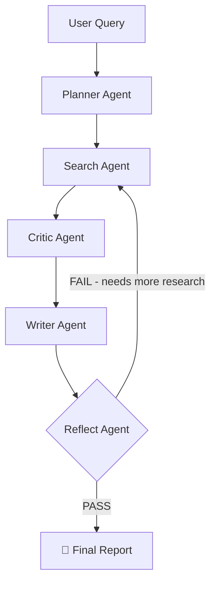

# 🔍 Research Buddy
Multi-agent AI research assistant powered by LangGraph + Groq + Exa.

[](https://huggingface.co/spaces/ridzzzzzzzzzzzzzz/Research-Buddy)

## Overview
Overview
Research Buddy is a multi-agent agentic AI application that takes a user query and autonomously plans, searches, validates, writes, and self-reviews a comprehensive research reportwithout any human input in between.
Each agent is specialized, stateful, and feeds into the next. The pipeline can loop back on itself if the reflect agent determines the report is insufficient.

## Architecture

## Agent Breakdown
### 🧠 Planner Agent
Breaks the user's raw query into exactly 3 focused sub-questions that together fully cover the topic. These become the search inputs.
### 🔍 Search Agent
Runs each sub-question through Exa's neural search API, returning 2 results per query (6 sources total). Exa's semantic search naturally surfaces credible, authoritative sources. On a reflect retry, uses new queries generated by the Reflect agent instead of the original sub-questions.
### 🔬 Critic Agent
The quality layer. For each source it:

Scores relevance (0–1) and quality (0–1) based on actual content — whether it cites data, names institutions, references methodology
Computes a composite score combining LLM relevance (35%), LLM quality (35%), and Exa's own neural score (30%)
Drops off-topic sources, marketing fluff, homepage URLs, and duplicate domains
Flags contradictions between sources and passes them through to the report
Produces a full audit trail (kept, dropped, contradictions) visible in the Source Audit tab

### ✍️ Writer Agent
Synthesizes validated sources into a structured markdown report with:

Inline citations per claim [Source N] that resolve to clickable links
A Conflicting Evidence section when contradictions are detected
A Research Gaps section pointing to what wasn't answered

### 📊 Reflect Agent
Grades the final report on comprehensiveness and source quality. Issues a PASS or FAIL. On FAIL, generates 2 new targeted search queries and loops the pipeline back through the Search agent. Maximum 2 retries before forcing a pass.

## Features

- 🔁 Self-reflection loop — agents grade and retry their own output
- 🔬 Source quality audit — every source scored, dropped sources explained, contradictions surfaced
- 🔗 Clickable inline citations — [1] links directly to the source
- ⚡ Model fallback chain — automatically switches between llama-3.3-70b-versatile → llama-4-scout-17b → llama-3.1-8b-instant on rate limits
- 📡 Live agent status streaming — watch each agent work in real time
- 🌐 Neural web search — Exa's semantic search surfaces credible sources without domain whitelists
- 📄 Structured markdown reports — executive summary, findings, conflicting evidence, research gaps, sources

## Tech Stack
- **LangGraph** — agent orchestration & state machine
- **GroqLLM backbone** — (Llama 3.3 70b + fallback chain)ExaNeural web search — semantic, research-grade results
- **Gradio** — UI
- **HuggingFace Spaces** — deployment

##  How It Works — End to End

1. User submits a query
2. Planner breaks it into 3 sub-questions
3. Search fetches 2 Exa results per sub-question → 6 sources
4. Critic scores each source, drops low-quality ones, flags contradictions
5. Writer generates a cited report from validated sources only
6. Reflect grades the report — if it fails, new queries are generated and steps 3–5 repeat (max 2 times)
7. Final report streams to the UI with a full source audit available in the second tab

## Setup
```bash
git clone https://github.com/YOUR_USERNAME/research-buddy
cd research-buddy
pip install -r requirements.txt
```

Create a `.env` file:
GROQ_API_KEY=your_key
EXA_API_KEY=your_key

Run locally:
```bash
gradio app.py
```
